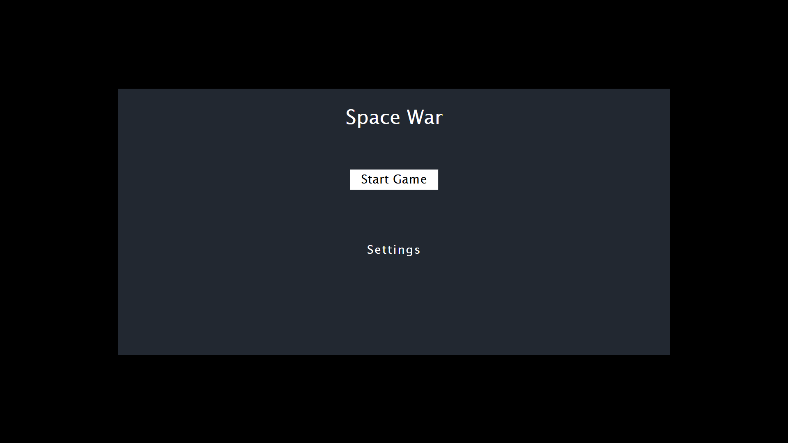
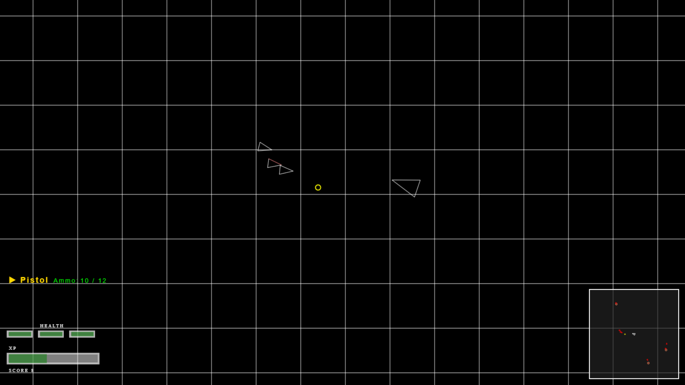

# Space War

## Oyun Amacı
Space War, 2D bir uzay savaş oyunudur. Amacınız, uzay geminizi geliştirerek düşmanları yok etmek, para ve deneyim puanı (XP) toplayarak seviyenizi yükseltmek ve hayatta kalmaktır. 

## Nasıl Oynanır?
- **W-A-S-D**: Hareket, Menü Yönetim
- **Space-Enter** Menüde Seçenek Seçme
- **Escape-Backspace** Menüden Çıkma, Oyunu Durdurma
- **Mouse**: Nişan alma (dönme)
- **Sol Mouse**: Ateş etme
- **R**: Şarjör değiştir (reload)
- **1-2-3-4-5**: Silah değiştir
- **Para ve XP**: Düşmanları yok ederek para ve XP kazanırsınız. XP ile seviye atlayıp yeni silahlar açılır.

## İçerik
- Gelişmiş fizik ve çarpışma sistemi
- Farklı silahlar (Pistol, Revolver, Machine Gun, Sniper vb.)
- Seviye sistemi ve otomatik silah açma
- Mini harita
- Oyun içi ses efektleri
- Menü ve ayarlar

## Kurulum ve Çalıştırma
- `index.html` dosyasını bir tarayıcıda açarak oyunu başlatabilirsiniz.
#### Veya
- [bu adresten](https://hiddenoob.github.io/space-war/) doğrudan oynayabilirsiniz.

## Oyundan Görseller
### Ana Menü

### Oyun İçi

### Proje Tanıtımı

